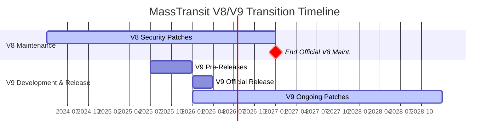

Following the news on Automapper and Mediator, the announcement about MassTransit caught everyone’s attention. MassTransit has long been the go-to solution for enterprise messaging processing and beyond because it was not only robust—it was free. But now, with Version 9, we’re entering a new era.
## The Announcement Details

MassTransit's team announced that while version 8 will remain open-source under its current Apache 2.0 license, version 9 will move to a commercial licensing model. The transition timeline includes:

- Q3 2025: MassTransit v9 prerelease packages available to early adopters
- Q1 2026: Official release of v9 under the commercial license
- End of 2026: Conclusion of official maintenance for MassTransit v8

During this transition period, the team has committed to providing security patches and community support for v8 users, ensuring organizations have time to adapt to the new model

## Why the Change?

The MassTransit team cites several compelling reasons for this transition:

1. **Project Growth and Complexity**: What started in 2007 as a single assembly supporting MSMQ has evolved into a comprehensive solution with over thirty NuGet packages supporting multiple message brokers, databases, and advanced capabilities.

2. **Enterprise Adoption**: MassTransit has become mission-critical infrastructure for organizations across more than 100 countries in industries including finance, healthcare, logistics, and government.

3. **Resource Requirements**: The growing adoption has created demand for dedicated full-time development resources, enterprise-grade support, and a sustainable funding model to drive continued innovation.

## Impact on Developers and Organizations

For current MassTransit users, the impact varies depending on your situation:

- **Version 8 Users**: You can continue using v8 with no changes as it remains open-source and available. Security patches and community support will continue through the transition period.

- **Support Agreement Holders**: If you currently have a support agreement, you'll be granted a license for MassTransit v9 through the remainder of your support period.

- **Enterprise Users**: Organizations seeking new features, performance enhancements, and enterprise-focused capabilities will need to consider the commercial licensing options for v9.

## Part of a Broader Trend

MassTransit's announcement comes alongside similar moves from other prominent .NET open-source projects. Jimmy Bogard, creator of AutoMapper and MediatR, also announced plans to commercialize these libraries around the same time. This growing trend reflects the challenges of maintaining complex open-source projects long-term without sustainable funding models.

The timing of these announcements—particularly coming shortly after the controversial FluentAssertions pricing model of $130 per developer per year announced earlier—has raised eyebrows in the .NET community. Some developers have expressed surprise, especially given that Jimmy Bogard had previously stated he would "never commercialize mediator" just months before his announcement.

## Commercial Model Speculation

While specific pricing details haven't been announced, industry observers speculate that MassTransit will likely adopt a tiered model similar to IdentityServer, with:

- A free tier for hobbyists and small projects
- Paid licenses required for companies exceeding a certain revenue threshold (possibly $1 million/year)

This approach would align with existing commercial messaging solutions like NServiceBus, which has operated as a commercial product since its inception[2].

## Community Reactions

The .NET community's reaction has been mixed but generally understanding. Many developers recognize the value these libraries provide and acknowledge the need for sustainable funding models. As one Reddit commenter noted: "I think they should always have a free tier for companies under a certain amount of revenue... If any business, small or big uses something, it must pay for it. It's absurd not to."

## Looking Ahead

For organizations currently using MassTransit, now is the time to evaluate your options:

1. **Continue with v8**: A viable option for many use cases, with community support continuing beyond 2026.
2. **Plan for v9 adoption**: Consider budgeting for commercial licensing if you need the latest features and enterprise support.
3. **Explore alternatives**: While migration from MassTransit can be challenging, alternatives like Wolverine (part of the JasperFx stack) or NServiceBus exist for those seeking different options.

The commercialization of MassTransit represents both a challenge and an opportunity for the .NET ecosystem—ensuring the sustainability of critical infrastructure while potentially reshaping how developers approach open-source dependencies in their enterprise applications.
