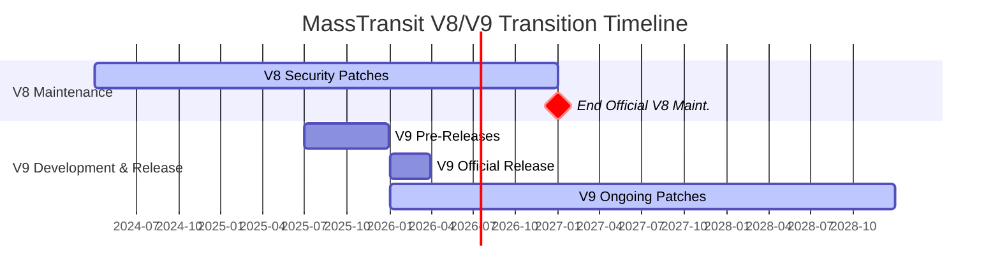

# MassTransit V9 Goes Commercial: What .NET Developers Need to Know

## The TL;DR: V8 Stays Free, V9 Goes Commercial

MassTransit has been a cornerstone of .NET messaging for years, valued for being both powerful and free (under the Apache 2.0 license). That's changing with the upcoming Version 9.

Here's the breakdown:

*   **MassTransit v8:** Remains open-source under Apache 2.0. You can continue using it freely. Official maintenance (security patches, community support) will continue until the **end of 2026**.
*   **MassTransit v9:** Will be released under a **commercial license**. Early access begins in Q3 2025, with the official release planned for Q1 2026.
  

## Why the Change?

The MassTransit team cites several compelling reasons for this transition:

1. **Project Growth and Complexity**: What started in 2007 as a single assembly supporting MSMQ has evolved into a comprehensive solution with over thirty NuGet packages supporting multiple message brokers, databases, and advanced capabilities.

2. **Enterprise Adoption**: MassTransit has become mission-critical infrastructure for organizations across more than 100 countries in industries including finance, healthcare, logistics, and government.

3. **Resource Requirements**: The growing adoption has created demand for dedicated full-time development resources, enterprise-grade support, and a sustainable funding model to drive continued innovation.

## How Does This Affect You?

The impact depends on how you use MassTransit:

*   **Using MassTransit v8:** You can continue using v8 under the Apache 2.0 license indefinitely. You'll receive security patches and community support until the end of 2026. For many, sticking with v8 might be perfectly viable.
*   **Have an Active Support Agreement:** Your existing agreement will grant you a license for MassTransit v9 for the remainder of its term.
*   **Need/Want v9 Features:** If you require the new features, performance improvements, or enterprise capabilities planned for v9 (or need support beyond 2026), you'll need to purchase a commercial license.

## Part of a Bigger Picture in .NET Open Source

This isn't an isolated event. Around the same time, Jimmy Bogard announced commercialization plans for AutoMapper and MediatR, two other widely used .NET libraries. This trend highlights the increasing difficulty of sustaining complex, critical open-source projects purely on volunteer effort or donations, especially when they become heavily relied upon by commercial enterprises.

The timing, shortly after the community discussion around FluentAssertions' proposed $130/dev/year model, has certainly fueled debate. Some developers noted the shift, especially regarding MediatR, given past statements about keeping it free.

*Context: A previous statement regarding MediatR's commercialization.*

These moves signal a potential shift in the .NET open-source landscape, forcing teams to evaluate the long-term sustainability of their dependencies.

## What Might the Commercial Model Look Like? (Speculation)

MassTransit hasn't released official pricing yet. However, looking at similar transitions (like IdentityServer) and existing commercial messaging platforms (like NServiceBus), a tiered model seems likely:

*   **Free Tier:** Possibly for individual developers, open-source projects, or very small companies (e.g., under a certain revenue threshold like $1M/year).
*   **Paid Tiers:** Required for commercial use in larger organizations, likely varying based on company size, usage volume, or required support levels.

This approach allows continued use for hobbyists and small startups while requiring businesses deriving significant value to contribute financially.

## Community Buzz: Understanding, with Questions

The reaction in the .NET community seems largely understanding, if not universally enthusiastic. Many developers acknowledge the immense value MassTransit provides and recognize that sustainable funding is necessary for its continued development and support.

A common sentiment, echoed on platforms like Reddit, is supportive of commercial models *if* they include fair terms, like a free tier for smaller entities: *"I think they should always have a free tier for companies under a certain amount of revenue... If any business, small or big uses something, it must pay for it."*

## What Are Your Options Now?

If your organization relies on MassTransit, it's time to strategize:

1.  **Stay on v8:** Continue using the free, open-source version. This is a valid path, especially if your feature needs are met and you're prepared for community-only support after 2026.
2.  **Budget for v9:** If you anticipate needing the latest features, performance updates, or guaranteed long-term support, start planning and budgeting for a commercial v9 license. Keep an eye out for official pricing details.
3.  **Evaluate Alternatives:** While migrating off a deeply integrated library like MassTransit is a significant undertaking, alternatives exist. Consider options like:
    *   **Wolverine:** Part of the JasperFx stack, offering messaging and more (also exploring sustainability models).
    *   **NServiceBus:** A mature, commercial-first enterprise service bus.
    *   **Built-in Cloud Services:** Leveraging Azure Service Bus, AWS SQS/SNS, or Google Pub/Sub directly with their respective SDKs.

**In Conclusion:** MassTransit's move to a commercial model for v9 marks a significant moment for the library and the .NET community. While v8 remains a free option with support through 2026, planning for the future whether sticking with v8, budgeting for v9, or exploring alternatives is crucial for development teams relying on this powerful messaging framework.
