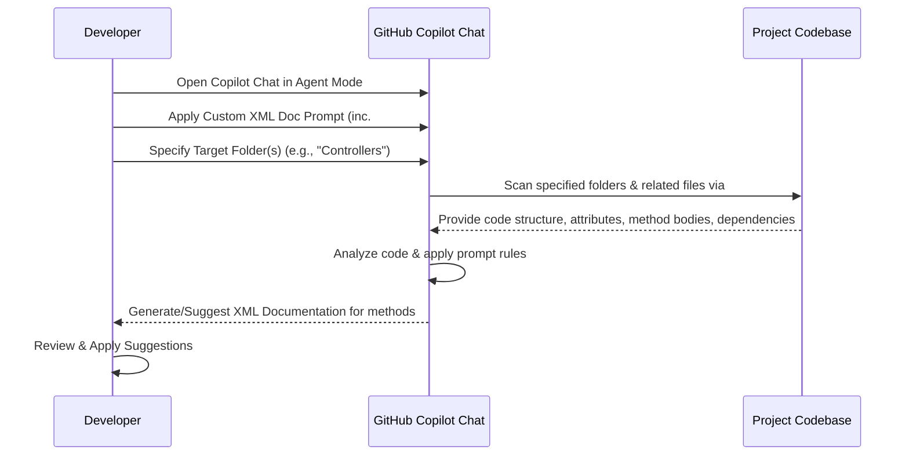

## Drowning in API Docs? Automate it with GitHub Copilot Agent Mode

**Who is this for?** Developers working on large projects with numerous REST API endpoints.

**What will you gain?** A practical method to automate the generation of XML documentation comments for your REST controllers using GitHub Copilot's Agent Mode and custom prompts, saving significant time and effort.

---

If you've ever faced the daunting task of documenting a large API surface – maybe hundreds of controllers and methods – you know the pain. It's repetitive, time-consuming, and requires deep understanding of each endpoint's business logic. I recently stared down this exact challenge: 171 controllers and over 700 methods needing clear, consistent XML documentation. Manually, this felt like an impossible mountain to climb.

Naturally, AI came to mind. Repetitive tasks are its specialty. But there's a catch: most AI tools need *context*. Cloud-based AI was a non-starter due to code privacy concerns. Local models via Ollama struggled because providing enough context (controllers *plus* all their dependencies across the solution) was difficult.

The breakthrough came with GitHub Copilot. It already lives in my IDE and has inherent access to my codebase. But how could I leverage it systematically across the *entire* solution?

### Enter Agent Mode: Beyond Single-File Edits

While Copilot's inline suggestions and standard chat are helpful, they often lack the broad context needed for complex tasks like comprehensive documentation. I experimented with **Agent Mode** in Copilot Chat and found it significantly more effective for this task.

Unlike basic chat or edit mode, Agent Mode actively searches across your specified workspace (or targeted folders) to find relevant code, dependencies, and context. It doesn't just look at the open file; it digs deeper, mimicking how a developer would explore the codebase to understand relationships between classes and methods. This broader context is crucial for generating meaningful documentation.

### Crafting the Perfect Prompt for Automation

To ensure consistency across all 700+ methods, I needed a reusable, detailed prompt. VS Code custom prompt feature is perfect for this. Here's the prompt I developed:

```text
Your goal is to update or create XML documentation for C# REST controllers and methods.

Requirements for the documentation:
- Always add `<summary>` tag with business-oriented description of method
- Add to the context request and response classes from @codebase for analyzed REST methods to provide better description
- Always add `<param>` tag for each parameter in method with short description
- Prefer words: "return" for fetching objects, "save" for creating and "update" for modifying
- Always add `<returns>` tag if the method doesn't return void with short description
- Always add `<remarks>` tag with some remarks about details of logic of the method
- Do not describe constructors of REST controllers
- Always add "Access is restricted by..." if privilege/permission attributes are present
- Always add description for query-enabling attributes (like OData query support)
- If expand/select capabilities are enabled via attributes, add: "Allows for customizing the response content through expand and select OData options."
- If transaction requirement is indicated, then add: "This operation is executed within a transaction database context to ensure data integrity"
- Focus on business logic not technical details when describing

Examples:

```

```csharp
    /// 
    ///     Update an existing product's information.
    /// 
    /// Product identifier
    /// Updated product data model
    /// Updated product entity with changes applied
    /// 
    ///     This method updates specific fields of an existing product identified by product ID.
    ///     The patch operation allows for partial updates to product information such as
    ///     name, description, price, and inventory status.
    ///     After saving, the updated product information is retrieved and returned.
    ///     This operation is executed within a transaction database context to ensure data integrity.
    ///     The expand and select capabilities (OData) allow for customizing the response content.
    ///     Access is restricted by the ProductUpdate privilege.
    /// 
    [HttpPatch]
    [Route("{id}")]
    [ApiOperation(ApiFlag.RequireTransaction)]
    [EnableExpandSelect]
    [Authorize(Policy = "ProductUpdate")]
    public ActionResult UpdateProduct([FromRoute] string id,
        [FromBody] ProductDto model)
    {
        return Ok(_productService.UpdateProduct(id, model));
    }
```

```csharp
 /// 
    /// Deactivates a user account for security purposes.
    /// 
    /// Deactivation request containing the user ID and reason for deactivation
    /// Response with the result of the deactivation operation
 /// 
 /// This method allows administrators to immediately secure the system when a user account is compromised.
 /// The action helps prevent unauthorized access and potential data breaches.
 /// Access is restricted by the UserManagement privilege.
 /// 
    [HttpPost]
    [Route("deactivate")]
    [ApiConventionMethod(typeof(DefaultApiConventions), nameof(DefaultApiConventions.Post))]
    [Authorize(Policy = "UserManagement")]
    [ApiOperation(ApiFlag.RequireTransaction)]
    public ActionResult DeactivateUser([FromBody] DeactivationRequest request)
    {
        return Ok(_userService.DeactivateUser(request));
    }
```

**Key Elements of the Prompt:**

*   **Clear Goal:** Explicitly states the task (generate/update XML docs).
*   **Specific Formatting:** Dictates required tags (`<summary>`, `<param>`, `<returns>`, `<remarks>`).
*   **Content Guidelines:** Specifies business-oriented language, preferred verbs (return, save, update), and handling of attributes (Authorization, OData, Transactions).
*   **Contextual Clues:** Asks Copilot to consider request/response classes.
*   **Exclusions:** Tells Copilot to ignore constructors.
*   **Crucial Variable:** Includes `#codebase` to instruct Copilot to search the entire workspace for relevant information.
*   **Examples:** Provides concrete examples of the desired output format and style.

### Codebase: Unleashing Full Project Awareness

The `#codebase` variable is the magic ingredient. It tells Copilot Agent Mode, "Don't just look at the code I explicitly mention; search the entire loaded project/solution for related classes, methods, and context." This allows it to understand dependencies (like services called by the controller, DTOs used, base classes) and generate much more accurate and relevant documentation.

### Workflow Visualization

Here's a simple diagram illustrating the process:



### Putting It Into Practice: Targeting Your Controllers

To apply this to your project:

1.  Open GitHub Copilot Chat in your IDE (ensure you're using a version that supports Agent Mode).
2.  Select the agent mode.

    

3.  Load your customized prompt.
   
    
    
4.  Tell Copilot which part of the codebase to focus on. You can often "Add Context..." or mention specific folders. For instance, after the prompt, you might add:
    `Please process the controllers in the 'src/MyApi/Controllers' folder.`
5.  Copilot will then analyze the files in that folder, using the `#codebase` context to understand dependencies, and start generating documentation based on your prompt.

You might need to run this process iteratively, perhaps focusing on one controller or a small group at a time, reviewing the suggestions, and applying them. While it's not a single magic button for the *entire* solution at once, it dramatically reduces the manual effort for each file.

### Key Takeaways

*   **Manual Documentation is Painful:** Large APIs demand significant documentation effort.
*   **AI Needs Context:** Standard AI tools struggle without access to your full codebase.
*   **Copilot Agent Mode is Key:** Its ability to search across the workspace `#codebase`provides the necessary context.
*   **Custom Prompts Ensure Consistency:** Define clear rules and examples for reliable, formatted output.
*   **Targeted Application:** Focus Copilot on specific folders (like your Controllers directory) for manageable processing.

By combining GitHub Copilot's Agent Mode with well-crafted custom prompts, you can transform the tedious task of API documentation from a manual slog into a manageable, semi-automated process, freeing up valuable developer time. Give it a try on your own C# projects!
